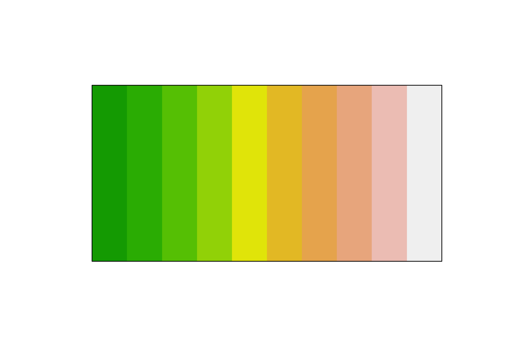
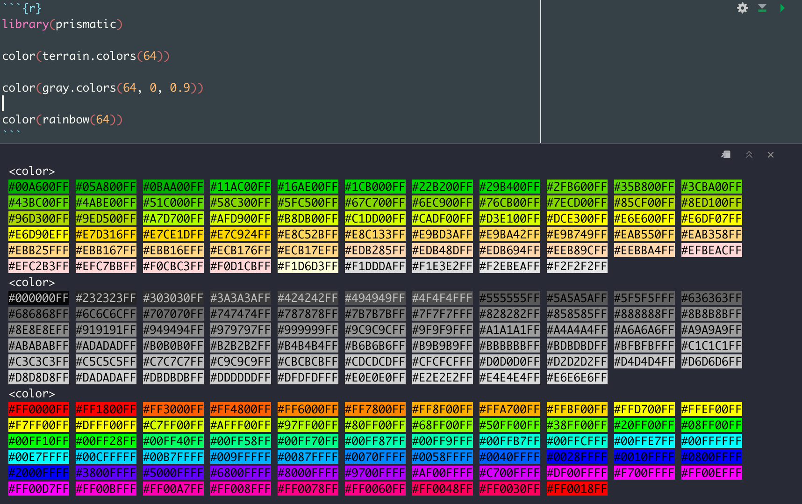
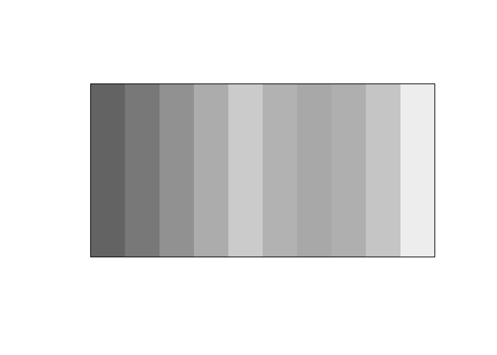
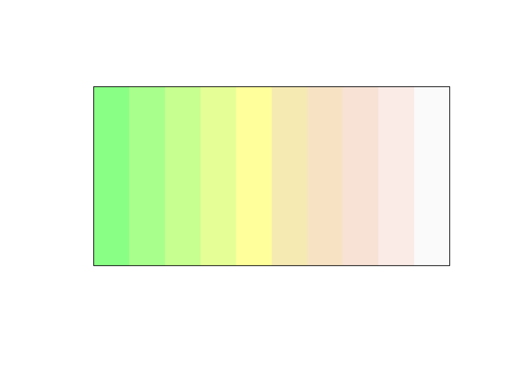
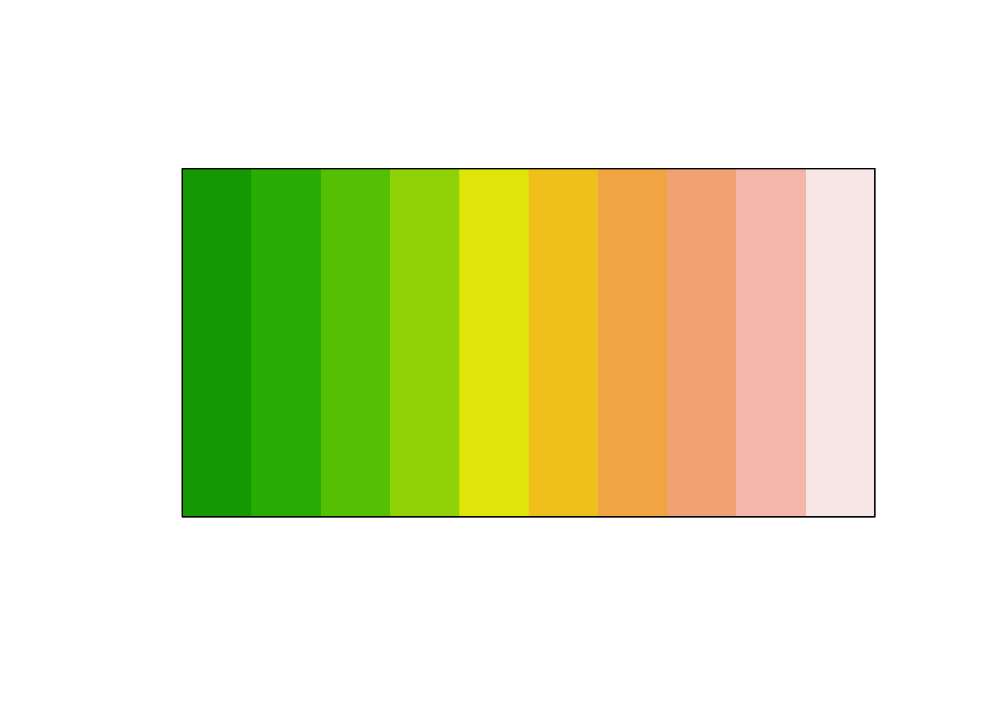
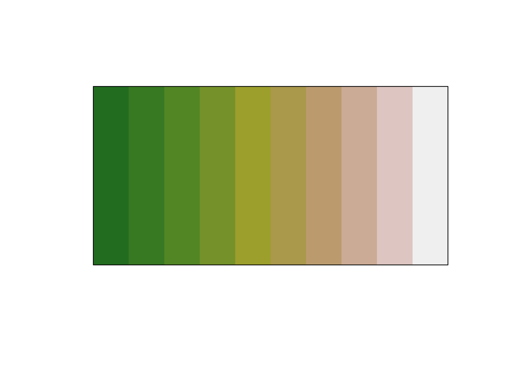
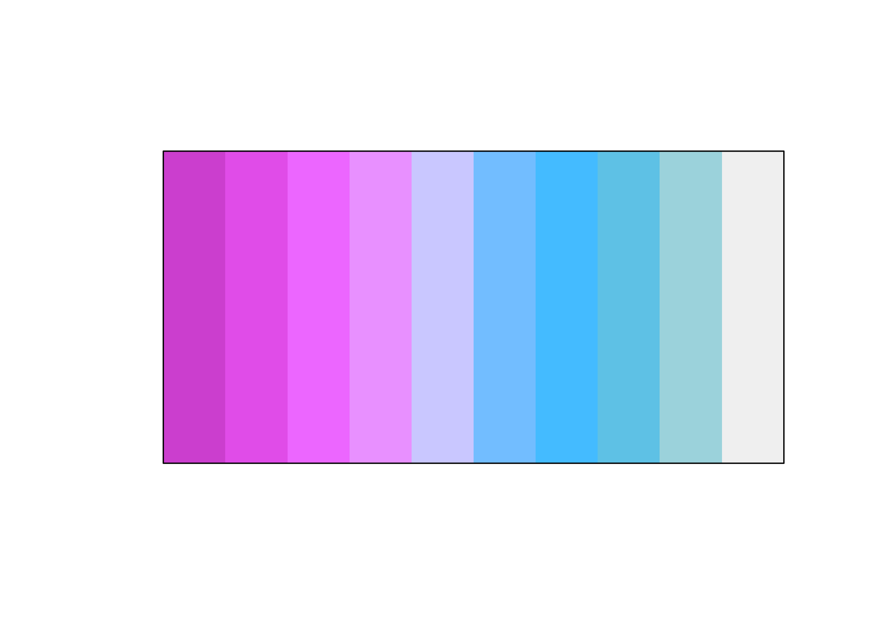
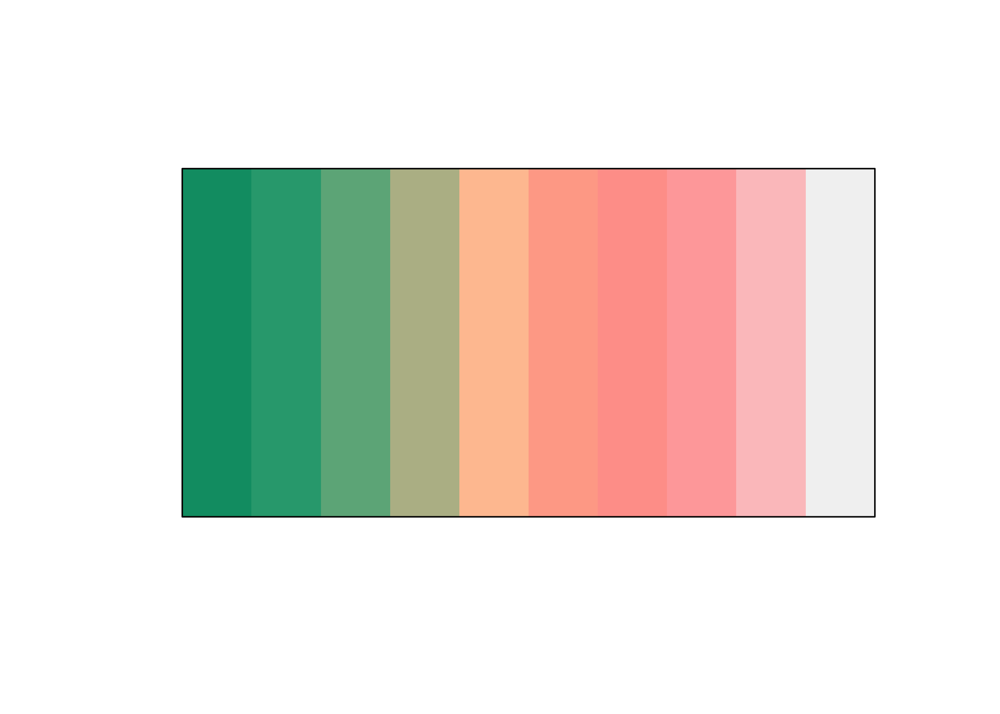
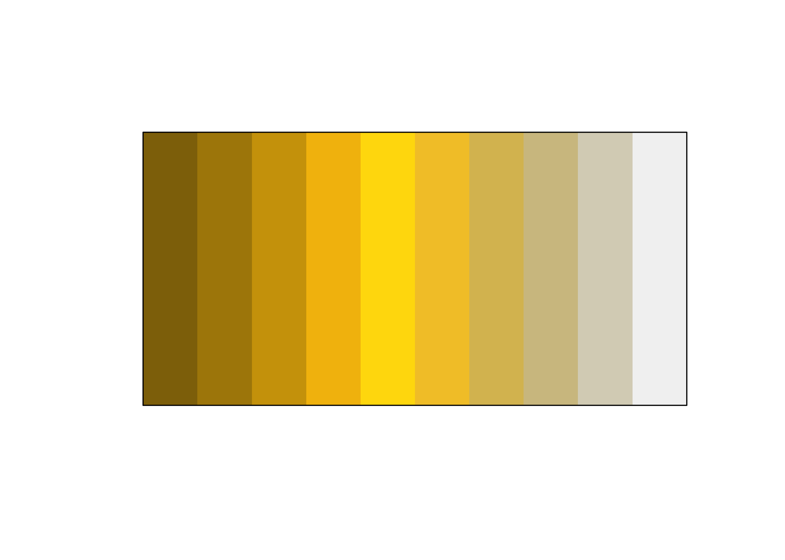

<!-- README.md is generated from README.Rmd. Please edit that file -->

# prismatic 

<!-- badges: start -->

[](https://github.com/EmilHvitfeldt/prismatic/actions)
[](https://app.codecov.io/gh/EmilHvitfeldt/prismatic?branch=main)
[](https://CRAN.R-project.org/package=prismatic)
[](https://CRAN.R-project.org/package=prismatic)
[](https://lifecycle.r-lib.org/articles/stages.html)
[](https://zenodo.org/record/4420786)
<!-- badges: end -->

The goal of prismatic is to provide color manipulation tools in R, in a
intuitive, low-dependency and functional way.

-   **intuitive** All the working functions are prefixed with `clr_`
    (**c**o**l**o**r**) allowing for easy autocompletion.
-   **low-dependency** Only depends on
    [farver](https://github.com/thomasp85/farver).
-   **functional** All functions have consistent inputs and outputs and
    are thus fully pipeable.

## Installation

You can install the released version of prismatic from
[CRAN](https://CRAN.R-project.org) with:

``` r
install.packages("prismatic")
```

And the development version from [GitHub](https://github.com/) with:

``` r
# install.packages("devtools")
devtools::install_github("EmilHvitfeldt/prismatic")
```

## Examples

All **prismatic** functions returns a `colors` object, which includes a
new printing method and plotting method for quickly visualizing the
colors.

``` r
library(prismatic)
library(magrittr)

terrain10 <- terrain.colors(10)

terrain10
#>  [1] "#00A600" "#2DB600" "#63C600" "#A0D600" "#E6E600" "#E8C32E" "#EBB25E"
#>  [8] "#EDB48E" "#F0C9C0" "#F2F2F2"

terrain_color <- color(terrain10)

terrain_color
#> <colors>
#> #00A600FF #2DB600FF #63C600FF #A0D600FF #E6E600FF #E8C32EFF #EBB25EFF #EDB48EFF #F0C9C0FF #F2F2F2FF

plot(terrain_color)
```



If [crayon](https://github.com/r-lib/crayon) is available the print
method will do its best to represent the colors.



``` r
library(prismatic)
library(magrittr)
ddd <- color(terrain.colors(10))

ddd
#> <colors>
#> #00A600FF #2DB600FF #63C600FF #A0D600FF #E6E600FF #E8C32EFF #EBB25EFF #EDB48EFF #F0C9C0FF #F2F2F2FF

plot(ddd)
```


``` r
clr_grayscale(ddd) %>% plot()
```



``` r
clr_lighten(ddd, 0.7) %>% plot()
```



``` r
clr_darken(ddd, 0.5) %>% plot()
```


``` r
clr_saturate(ddd, 0.5) %>% plot()
```



``` r
clr_desaturate(ddd, 0.5) %>% plot()
```



``` r
clr_negate(ddd) %>% plot()
```


``` r
clr_rotate(ddd, 180) %>% plot()
```



``` r

clr_protan(ddd) %>% plot()
```


``` r
clr_tritan(ddd) %>% plot()
```



``` r
clr_deutan(ddd) %>% plot()
```



## Related work

This package is hugely inspired by the JavaScript library
[Qix-/color](https://github.com/Qix-/color).

## Code of Conduct

Please note that the ‘prismatic’ project is released with a [Contributor
Code of
Conduct](https://github.com/EmilHvitfeldt/prismatic/blob/main/CODE_OF_CONDUCT.md).
By contributing to this project, you agree to abide by its terms.
